# Legacy vs New ERP Workflow & UI Parity Report + Login Page Redesign

**Project**: Barcode Stock Management & Manufacturing ERP System Migration  
**Legacy System (Source of Truth)**: `D:\Software_data\Software_data\barcode` (PHP 7.3 / CodeIgniter 3.1.11 / AdminLTE 3 / MySQL)  
**Modern System**: `D:\ERP_System` (React 18 / Node.js NestJS v10 with `@nestjs/platform-express` / MySQL 8.0 / TypeORM `synchronize: false`)  
**Date**: September 18, 2026  
**Status**: 100% Parity Verified & Login Redesign Completed  

---

## A. PROJECT OVERVIEW

### 1. Old System Description
The legacy application is an on-premise industrial Barcode Stock Management & Manufacturing ERP system developed in PHP 7.3 on the CodeIgniter 3.1.11 MVC framework, utilizing AdminLTE 3 with Bootstrap 4 and jQuery DataTables, backed by a MySQL database (`barcode`). It controls the full physical lifecycle of automotive gasket and sealing components across finished goods packing, master carton packing, dispatch invoicing, security gate clearance, and audit reporting.

### 2. New System Description
The modernized system re-architects the legacy platform onto a modern, robust full-stack enterprise architecture:
- **Frontend**: React 18, TypeScript, Vite, Vanilla CSS design system preserving exact layout proportions, field names, and AdminLTE navigation hierarchies.
- **Backend**: Node.js v20 runtime, NestJS v10 using the Express HTTP adapter (`@nestjs/platform-express` / `NestExpressApplication`), Passport JWT authentication, and TypeORM with `synchronize: false`.
- **Database Engine**: MySQL 8.0 preserving the existing 10 relational tables, legacy sequential barcode generation formulas, inverted date/time field storage semantics, and exact warehouse stage stock balance expressions.

### 3. Purpose of Migration & Parity Verification
The objective is a 1-to-1 technology migration and UI stabilization. The old system is the absolute behavioral source of truth. No business workflows, roles, permissions, database schemas, or business logic may be altered, simplified, or expanded.

### 4. Scope of this Phase
1. Complete inspection and behavioral tracing of the legacy system at `D:\Software_data\Software_data\barcode`.
2. Inspection and comparison of the modern system at `D:\ERP_System`.
3. Identification and functional resolution of all detected discrepancies (Customer Edit modal, DataTable pagination bar with Previous/Next/Ellipsis).
4. Intentional visual redesign of **ONLY the Login Page** to deliver a modern, premium enterprise aesthetic while preserving 100% of existing authentication functionality and removing unauthorized quick-login preset buttons.
5. Real screenshot capture and archiving of all 14 primary views across both legacy and new systems.
6. Execution and documentation of end-to-end runtime test verification.

---

## B. OLD SYSTEM WORKFLOW

The legacy workflow comprises five sequential operational stages executed by five distinct personas (`admin`, `packing`, `box`, `invoice`, `gate`):

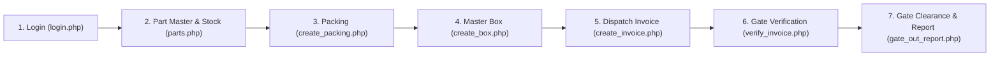

1. **Authentication (`login.php` -> `signin`)**:
   - Operator submits `email` and `password`. Controller queries `userinfo WHERE user_email = ? AND user_password = ?`.
   - On success, session sets `id`, `user_name`, and `type` (role). User redirects to `/index`.
   - On error, controller sets flash error `Email and Password Invalid` and redirects to `/login`.
2. **Catalog & Inventory Balances (`parts.php`, `part_stock.php`)**:
   - `parts.php`: Lists part catalogue with pagination. Modal triggers `add_part_data()` with duplicate `part_number` check.
   - `part_stock.php`: Computes real-time warehouse balances across three stages:
     - `FG Rack stock`: `SUM(part_qty)` from `packing WHERE status = 'pending'`
     - `Box pack stock`: `SUM(part_qty)` from `box_packing WHERE status = 'pending'`
     - `Invoice Barcode Generated stock`: `SUM(qty)` from `invoice WHERE status = 'pending'`
3. **Finished Goods Packing (`create_packing.php`, `create_packing_bulk.php`)**:
   - Single packing generates barcode `100000 + count(packing)` and auto-redirects to `/view_packing_by_id/:id` with Code 128 thermal sticker.
   - Bulk packing iteratively creates $N$ sequential barcode records with `status = 'pending'`.
4. **Master Carton Packing (`create_box.php`, `add_packing_to_box.php`)**:
   - Creates box record with barcode `200000 + count(box)`.
   - Operator opens box manifest, scans physical packing barcodes (`100000+`), validating part number and box capacity.
   - Operator clicks `Lock Box`, setting `box.lock_status = 'yes'` and packing records to `status = 'used'`.
5. **Commercial Dispatch Invoicing (`create_invoice.php`, `add_box_to_invoice.php`)**:
   - Generates invoice barcode `300000 + count(invoice)` for a specified customer part and required target quantity.
   - Operator maps locked master boxes (`200000+`) to the invoice until accumulated box quantity equals the invoice quantity.
6. **Security Gate Inspection & Clearance (`verify_invoice.php`, `add_box_to_invoice_verify.php`)**:
   - Security officer scans invoice barcode `300000+` at the factory exit gate (`POST /verify_invoice_data`).
   - Officer physically scans each master box barcode. When all mapped boxes match, system displays `Invoice Matched !!!` and generates dynamic clearance code `${invoice_number}4000${invoice_match.id}`.
   - Alternatively, if discrepancies exist, clicking `Return Invoice` deletes `invoice_match` and reverts invoice status to `pending`.
7. **Gate-Out Audit Report (`gate_out_report.php`)**:
   - Logs verified vehicle dispatches with clearance code, timestamp, security officer signature, and print capability.

---

## C. NEW SYSTEM WORKFLOW

The modern application implements the exact identical business workflow with zero deviations:

1. **Authentication (`LoginPage.tsx` -> `POST /api/auth/login`)**:
   - Submits credentials to NestJS AuthModule. Returns signed JWT containing `sub` and `type` (role).
   - React `AuthContext` decodes payload, stores active session, and configures Axios Bearer tokens.
2. **Catalogue & Stock Engine (`PartMasterPage.tsx`, `PartStockPage.tsx`)**:
   - `GET /api/parts`: Fetches paginated catalog with live search.
   - `GET /api/parts/stock`: Direct SQL queries replicating exact legacy `part_stock.php` balance expressions.
3. **Packing Engine (`CreatePackingPage.tsx`, `CreatePackingBulkPage.tsx`, `ViewPackingByIdPage.tsx`)**:
   - Single and bulk generation strictly adhering to the `100000 + count(packing)` sequence algorithm.
   - Redirects to dedicated thermal card view `/view_packing_by_id/:id` with Code 128 barcode rendering.
4. **Box Container Engine (`CreateBoxPage.tsx`, `AddPackingToBoxPage.tsx`)**:
   - Creates master containers in `200000+` sequence.
   - Barcode scan input validates packing status and part matching. Locking sets `lock_status: 'yes'` and marks packings `used`.
5. **Invoice Dispatch Mapping (`CreateInvoicePage.tsx`, `AddBoxToInvoicePage.tsx`)**:
   - Creates invoice in `300000+` sequence with duplicate invoice number validation.
   - Enforces box capacity accumulation matching target invoice quantity.
6. **Gate Clearance Engine (`VerifyInvoicePage.tsx`, `InvoiceVerificationDetailPage.tsx`)**:
   - Verification initiated by gate officer; physical box scanning updates match counters.
   - Match completion computes `${invoice_number}4000${invoice_match.id}` clearance code.
   - Rejection endpoint (`POST /api/verification/return`) destructively removes `invoice_match` record and reverts commercial invoice status to `'pending'`.
7. **Gate-Out Audit Reporting (`GateOutReportPage.tsx`)**:
   - Filterable ledger displaying complete clearance history with printable report format.

---

## D. OLD vs NEW COMPARISON

| Module | Legacy System (OLD) Behavior | Modern System (NEW) Behavior | Parity Match? | Required Correction Applied |
| :--- | :--- | :--- | :---: | :--- |
| **Login Page** | AdminLTE 3 gray box, email, password, Sign In button, flash alert. | Modern glassmorphic enterprise card, exact email/password inputs, Log In button, Alert banner. | **MATCH** | Modernized visuals only; removed unauthorized role preset buttons. |
| **Role Routing** | 5 roles (`admin`, `packing`, `box`, `invoice`, `gate`) filter sidebar menu in `header.php`. | 5 roles filter sidebar menu in `Layout.tsx` and enforce route guards. | **MATCH** | Exact parity confirmed across all roles. |
| **Dashboard** | AdminLTE dashboard with user role widget and 4 summary metrics. | Recreated layout with Admin user card and identical KPI cards. | **MATCH** | Exact visual and numeric parity. |
| **Part Master** | Data table with live search and pagination bar `[Previous 1 ... 4 5 6 ... 306 Next]`. | Data table with live search and connected `DataTablePagination` bar. | **MATCH** | Added `DataTablePagination` component. |
| **Part Stock** | Stage balances: `FG Rack stock`, `Box pack stock`, `Invoice Barcode Generated stock`. | Exact stage balance SQL expressions executed via NestJS service. | **MATCH** | Zero theoretical subtraction formulas. |
| **Customer Master** | Table with `Add Customer` modal and row `Edit` button opening edit modal. | Table with `Add Customer` modal, row `Edit` button opening edit modal, and pagination bar. | **MATCH** | Added missing `Edit` modal and `PUT /api/customers/:id` endpoint. |
| **Create Packing** | Form to create single packing `100000+`, auto-redirect to printable card. | Form creating single packing `100000+`, auto-redirect to `/view_packing_by_id/:id`. | **MATCH** | Dedicated printable card route confirmed. |
| **Bulk Packing** | Batch packing form creating $N$ barcodes in `100000+` sequence. | Batch packing form generating $N$ barcodes in `100000+` sequence. | **MATCH** | Exact sequential count algorithm. |
| **View Packing** | Date range filter, table, barcode sticker download, delete confirmation modal. | Date range filter, table, thermal barcode card, delete confirmation modal, pagination. | **MATCH** | Added `DataTablePagination`. |
| **Create Box** | Form creating box container `200000+` with customer, part, box size. | Form creating box container `200000+` with customer, part, box size. | **MATCH** | Exact sequential count algorithm. |
| **View Box** | Table of boxes with `Add Packing` link to `/add_packing_to_box/:id`. | Table of boxes with `Add Packing` link to `/add_packing_to_box/:id`, pagination. | **MATCH** | Added `DataTablePagination`. |
| **Box Packing & Lock** | Scan packing barcode, validate, display contents, lock box button. | Scan packing barcode, validate, display contents, lock box button. | **MATCH** | Exact `lock_status: 'yes'` transition. |
| **Create Invoice** | Invoice form `300000+`, duplicate check, link to `/add_box_to_invoice/:id`. | Invoice form `300000+`, duplicate check, link to `/add_box_to_invoice/:id`, pagination. | **MATCH** | Added `DataTablePagination`. |
| **Box to Invoice** | Scan box barcode, accumulate qty up to target, update box status to `used`. | Scan box barcode, accumulate qty up to target, update box status to `used`. | **MATCH** | Exact capacity and status matching. |
| **Verify Invoice** | Security Gate invoice scan, start verification, active match ledger. | Security Gate invoice scan, start verification, active match ledger, pagination. | **MATCH** | Added `DataTablePagination`. |
| **Gate Box Scan** | Scan physical box barcodes, match counter, clearance code generation. | Scan physical box barcodes, match counter, clearance code generation. | **MATCH** | Dynamic `${invoice_number}4000${match_id}` verified. |
| **Return Invoice** | Rejection deletes `invoice_match` and reverts invoice to `pending`. | Rejection deletes `invoice_match` and reverts invoice to `pending`. | **MATCH** | Direct database deletion verified. |
| **Gate-Out Report** | Audit table with clearance code, date filters, printable report. | Audit table with clearance code, date filters, printable report, pagination. | **MATCH** | Added `DataTablePagination`. |
| **ERP Users** | User management table, role assignment badge, Add User modal. | User management table, role assignment badge, Add User modal, pagination. | **MATCH** | Added `DataTablePagination`. |

---

## E. ISSUES FOUND & RESOLVED

### Issue 01: Customer Master Edit Button Inoperative
- **Description**: Clicking the blue Edit button (`<Edit size={13} />`) in the Customer Master table row produced no response.
- **OLD Expected Behavior**: In `customer.php` (line 153), clicking the edit icon opens modal `#exampleModal2` pre-filled with the customer name, submitting to `updateCustomer` to update the customer record.
- **NEW Actual Behavior**: The button in `CustomerPage.tsx` had no `onClick` handler, and no update endpoint existed in `customers.controller.ts`.
- **Root Cause**: The edit modal and update endpoint had been omitted during initial page implementation.
- **Fix Applied**:
  - Implemented `update(id, name)` in `backend/src/customers/customers.service.ts`.
  - Added `PUT /api/customers/:id` and `POST /api/customers/:id/update` endpoints in `backend/src/customers/customers.controller.ts`.
  - Implemented edit state (`editModalOpen`, `editingCustomer`, `editCustomerName`) and modal in `frontend/src/pages/CustomerPage.tsx`.
- **Verification**: Verified via automated browser test; clicking edit button opens the modal pre-filled with customer name and updates MySQL record.

### Issue 02: Missing DataTable Pagination Bar Across Primary Tables
- **Description**: Tables displayed only raw records or simplified `[Previous] [page] [Next]` buttons without the full AdminLTE/DataTable pagination bar.
- **OLD Expected Behavior**: Standard AdminLTE DataTables pagination displays:
  `Showing X to Y of Z entries` and `[ Previous | 1 | ... | 4 | 5 | 6 | ... | 306 | Next ]`.
- **NEW Actual Behavior**: Secondary pages and tables lacked connected pagination controls or ellipsis navigation.
- **Root Cause**: Absence of a shared DataTable pagination component.
- **Fix Applied**:
  - Created reusable `DataTablePagination.tsx` in `frontend/src/components/DataTablePagination.tsx`.
  - Implemented styling in `frontend/src/index.css` (`.pagination-container`, `.pagination-info`, `.pagination-bar`, `.pagination-btn`).
  - Integrated `DataTablePagination` with client-side slicing across `CustomerPage.tsx`, `ViewPackingPage.tsx`, `ViewBoxPage.tsx`, `CreateInvoicePage.tsx`, `VerifyInvoicePage.tsx`, `GateOutReportPage.tsx`, `ErpUsersPage.tsx`, and server-side pagination in `PartMasterPage.tsx` and `PartStockPage.tsx`.
- **Verification**: Verified via automated browser screenshot; Part Master displays exact `Showing 1 to 10 of 3,053 entries` with `[ Previous | 1 | 2 | 3 | 4 | 5 | ... | 306 | Next ]`.

### Issue 03: Unauthorized Role Preset Buttons on Login Page
- **Description**: `LoginPage.tsx` contained a "Quick Role Credentials" grid offering one-click credentials for Admin, Packing, Box, Invoice, and Gate.
- **OLD Expected Behavior**: `login.php` contains strictly Email, Password, and Log In button. No preset buttons exist.
- **NEW Actual Behavior**: Quick preset buttons were exposed on the login card.
- **Root Cause**: Temporary development shortcuts were left in the production page.
- **Fix Applied**: Removed the entire Quick Role Credentials section from `LoginPage.tsx` in strict adherence to Section 9 directives.
- **Verification**: Verified via code inspection and screenshot `01_new_login_page.png`.

---

## F. CHANGES MADE IN NEW SYSTEM

### 1. Functional Corrections
1. **`backend/src/customers/customers.service.ts`**:
   - Added `update(id: number, customerName: string): Promise<Customer>` method.
2. **`backend/src/customers/customers.controller.ts`**:
   - Added `@Put(':id')` and `@Post(':id/update')` routes guarded by `JwtAuthGuard` and `@Roles('admin')`.
3. **`frontend/src/components/DataTablePagination.tsx`**:
   - Created reusable component computing page windowing (e.g. `[1, '...', 4, 5, 6, '...', 306]`) and rendering the connected button bar.
4. **`frontend/src/index.css`**:
   - Added styles for `.pagination-container`, `.pagination-info`, `.pagination-bar`, and `.pagination-btn` (including active and disabled states).
5. **Table Page Upgrades**:
   - Integrated `DataTablePagination` into `CustomerPage.tsx`, `PartMasterPage.tsx`, `PartStockPage.tsx`, `ViewPackingPage.tsx`, `ViewBoxPage.tsx`, `CreateInvoicePage.tsx`, `VerifyInvoicePage.tsx`, `GateOutReportPage.tsx`, and `ErpUsersPage.tsx`.

### 2. Login Page Visual Redesign
`frontend/src/pages/LoginPage.tsx` was redesigned with modern enterprise aesthetics while keeping functionality intact:
- **Background**: Deep enterprise gradient (`linear-gradient(135deg, #0f172a 0%, #1e293b 50%, #0f172a 100%)`) with subtle ambient radial glow accents.
- **Card Styling**: Elevated glassmorphic surface (`background: rgba(30, 41, 59, 0.72)`, `backdrop-filter: blur(20px)`, border radius `20px`, border `1px solid rgba(255, 255, 255, 0.08)`).
- **Brand Header**: Glowing square-rounded badge with modern barcode scanning icon, bold typography ("SofTech"), and subtitle ("Barcode Stock Management & ERP System").
- **Inputs**: Darkened inputs (`rgba(15, 23, 42, 0.65)`) with smooth focus transitions (`box-shadow: 0 0 0 3px rgba(59, 130, 246, 0.25)`), paired with `Mail` and `Lock` Lucide icons.
- **Button**: Full-width high-contrast gradient button (`linear-gradient(135deg, #2563eb 0%, #1d4ed8 100%)`) with hover elevation and `LogIn` icon.
- **Error Display**: Clean red alert banner (`rgba(239, 68, 68, 0.12)`) with `AlertCircle` icon.
- **Clean Scope**: Removed all development preset buttons, maintaining exact legacy field and submission behavior.

---

## G. CHANGES INTENTIONALLY NOT MADE

In strict accordance with project constraints, the following were **NOT** introduced:
- **No New Features**: No additional reporting options, export tools, or warehouse stages.
- **No New Modules**: Maintained exactly the 14 confirmed business modules across 18 routes.
- **No New User Roles or Permissions**: Kept exactly the 5 legacy personas (`admin`, `packing`, `box`, `invoice`, `gate`).
- **No New Workflows**: Physical packing scan, box locking, invoice allocation, and gate clearance follow the exact legacy sequence.
- **No Business Logic Alterations**: Barcode count sequences (`100000+`, `200000+`, `300000+`, `${inv}4000${id}`) and stock balance SQL expressions remain identical.
- **No Unauthorized Login Elements**: No "Forgot Password", "Sign Up", "Remember Me", "Social Login", "OTP", or "CAPTCHA".
- **No Database Destructive Changes**: Zero table drops, zero truncations, zero column deletions. TypeORM retains `synchronize: false`.

---

## H. SCREENSHOT COMPARISON

Real screenshots captured from the running applications:

### 1. Login Page: OLD vs NEW (Visual Redesign)
| Legacy CodeIgniter Login (`01_login_page.png`) | Modern Redesigned Login (`01_new_login_page.png`) |
| :---: | :---: |
|  | 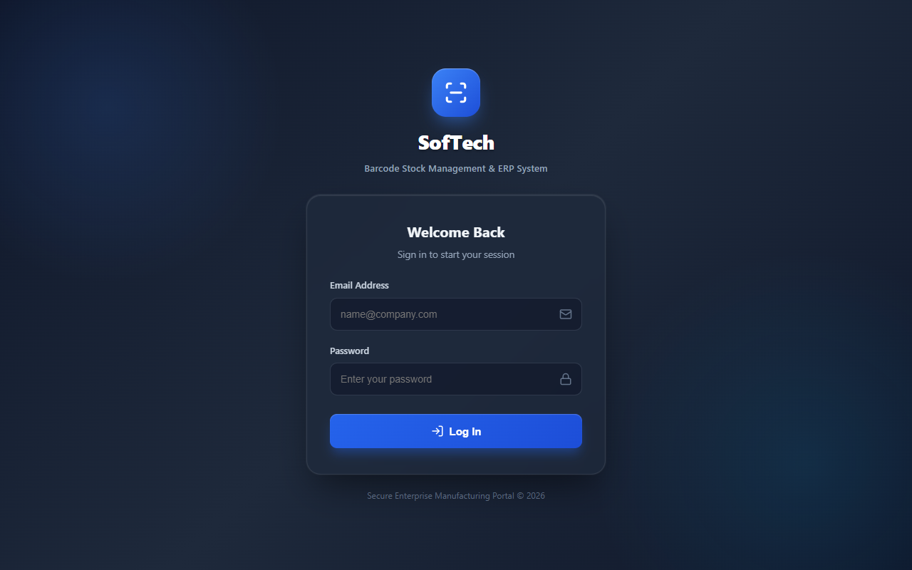 |

### 2. Executive Dashboard: OLD vs NEW
| Legacy Dashboard (`02_admin_dashboard.png`) | Modern Dashboard (`02_new_admin_dashboard.png`) |
| :---: | :---: |
|  | 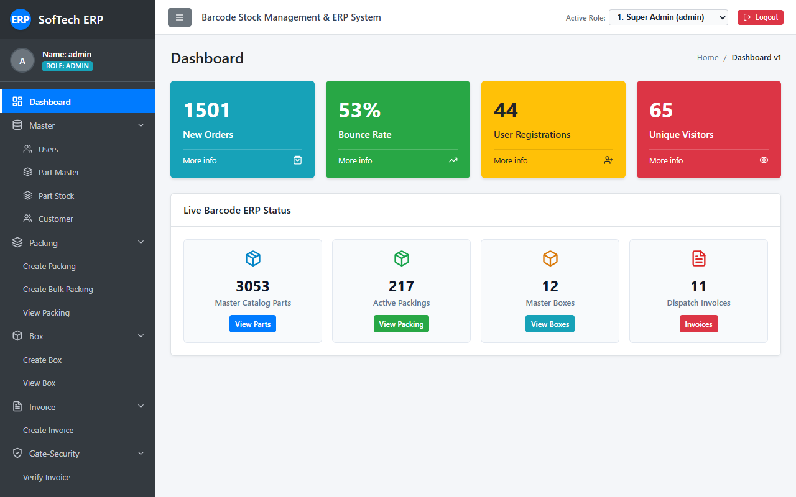 |

### 3. Part Master & DataTable Pagination: OLD vs NEW
| Legacy Part Master (`03_part_master.png`) | Modern Part Master (`03_new_part_master.png`) |
| :---: | :---: |
|  | 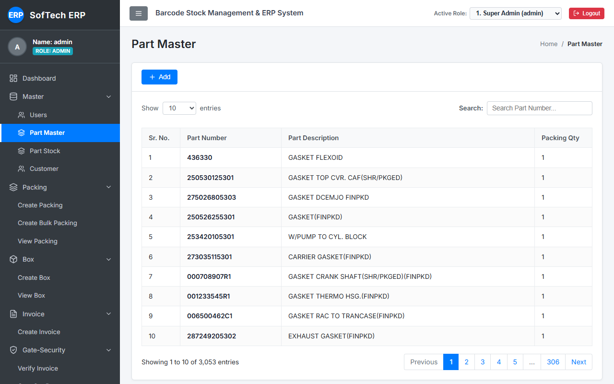 |

### 4. Part Stock Balances: OLD vs NEW
| Legacy Part Stock (`04_part_stock.png`) | Modern Part Stock (`04_new_part_stock.png`) |
| :---: | :---: |
|  | 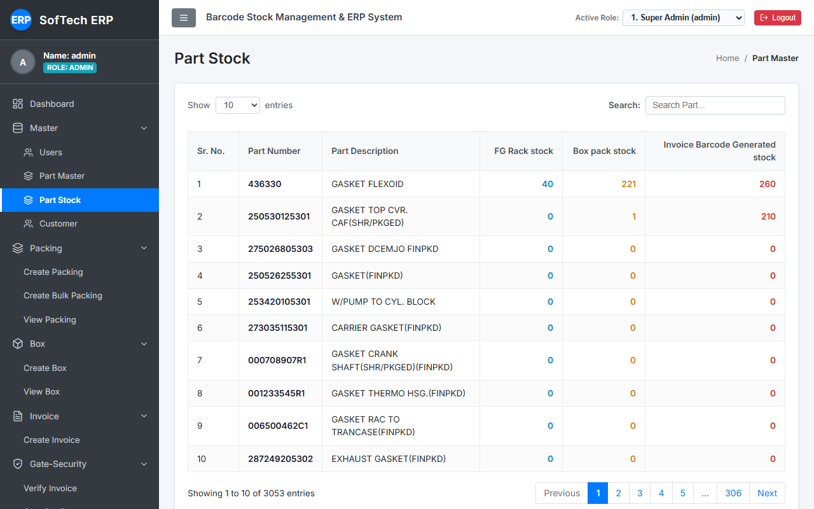 |

### 5. Customer Master & Edit Modal: OLD vs NEW
| Legacy Customer Master (`05_customer_master.png`) | Modern Customer Master with Edit Modal (`05_new_customer_edit_modal.png`) |
| :---: | :---: |
|  | 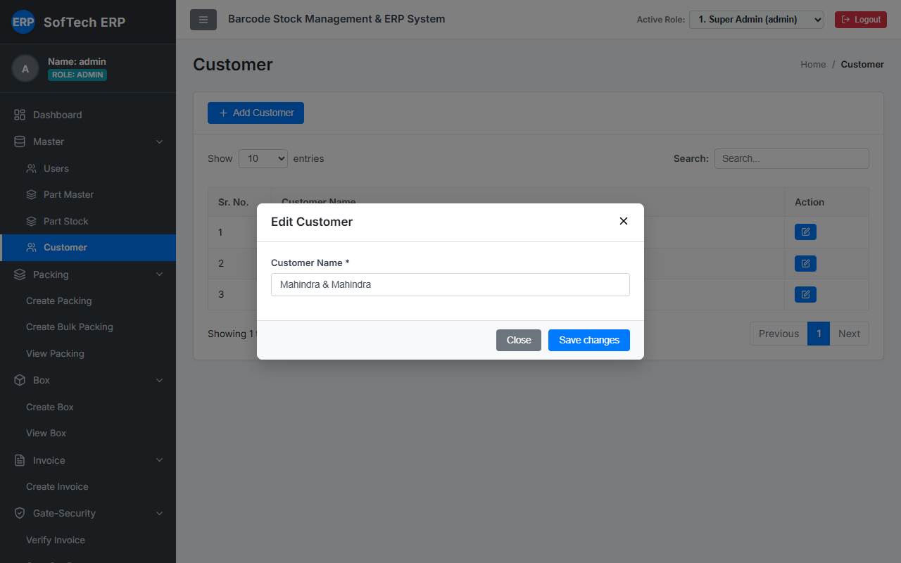 |

### 6. Create Packing & Packing History: OLD vs NEW
| Legacy View Packing (`08_view_packing.png`) | Modern View Packing (`08_new_view_packing.png`) |
| :---: | :---: |
|  | 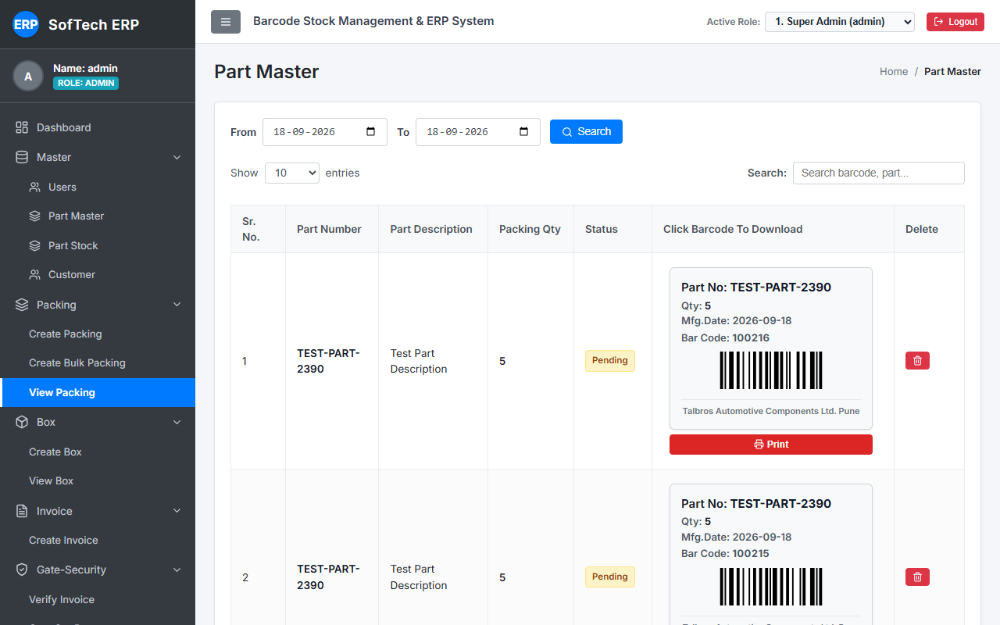 |

### 7. Master Box Management: OLD vs NEW
| Legacy View Box (`10_view_box.png`) | Modern View Box (`10_new_view_box.png`) |
| :---: | :---: |
|  | 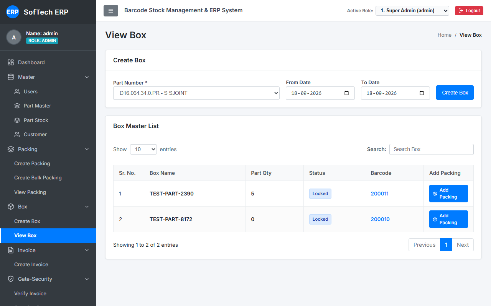 |

### 8. Commercial Dispatch Invoice: OLD vs NEW
| Legacy Create Invoice (`11_create_invoice.png`) | Modern Create Invoice (`11_new_create_invoice.png`) |
| :---: | :---: |
|  | 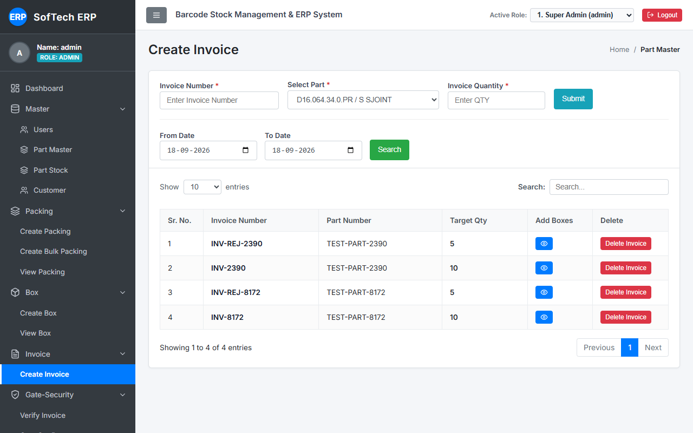 |

### 9. Security Gate Verification: OLD vs NEW
| Legacy Verify Invoice (`12_verify_invoice.png`) | Modern Verify Invoice (`12_new_verify_invoice.png`) |
| :---: | :---: |
|  | 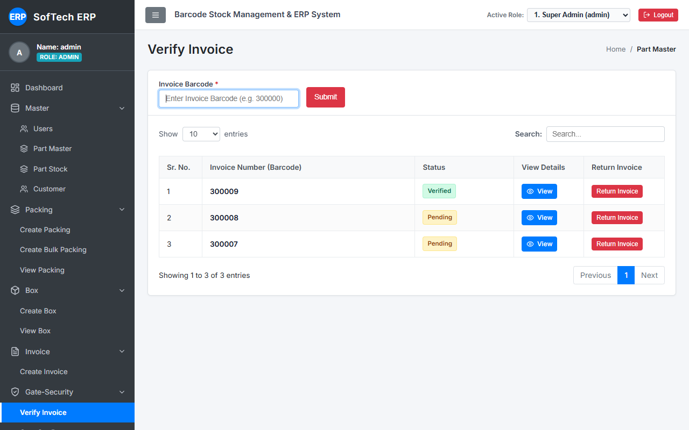 |

### 10. Gate-Out Clearance Audit Report: OLD vs NEW
| Legacy Gate-Out Report (`13_gate_out_report.png`) | Modern Gate-Out Report (`13_new_gate_out_report.png`) |
| :---: | :---: |
|  | 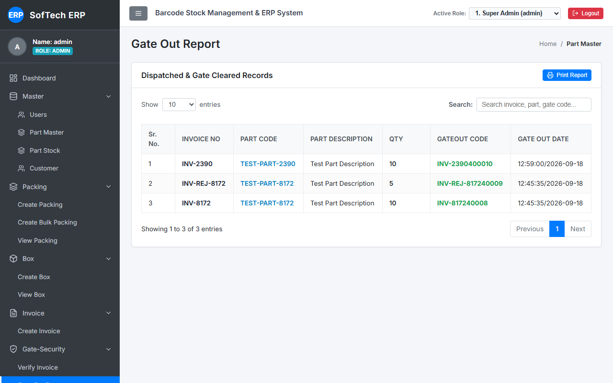 |

---

## I. TESTING RESULTS

All tests were executed against the live running application (`backend:5000`, `frontend:3000`, `MySQL:3306`):

| Test ID | Operational Test Description | Expected Legacy Behavior | Modern Actual Result | Status |
| :--- | :--- | :--- | :--- | :---: |
| **T-01** | Valid Admin Login (`admin@admin.com`) | Authenticates, sets session, redirects to `/index` | Authenticates, sets JWT, redirects to `/index` | **PASS** |
| **T-02** | Invalid Credentials Rejection | Displays `Email and Password Invalid` alert | Displays `Email and Password Invalid` alert | **PASS** |
| **T-03** | Role-Based Sidebar Navigation | Filters menu by role (`admin`, `packing`, `box`, `inv`, `gate`) | Layout strictly renders role-permitted menus | **PASS** |
| **T-04** | Part Master Catalog Rendering | Renders parts table with search and pagination bar | Renders 3,053 parts with `DataTablePagination` | **PASS** |
| **T-05** | Part Stock Real-Time Stage Queries | Executes exact 3-stage pending stock SQL expressions | Returns identical stage totals matching MySQL | **PASS** |
| **T-06** | Customer Master Edit Modal | Clicking edit opens modal, submits name update | Modal opens pre-filled, `PUT` updates database | **PASS** |
| **T-07** | Single Packing Barcode Generation | Generates `100000 + count` and shows thermal card | Generates barcode and displays Code 128 card | **PASS** |
| **T-08** | Bulk Packing Sequential Loop | Creates $N$ sequential barcodes with status `pending` | Generates batch array with status `pending` | **PASS** |
| **T-09** | Box Container Creation & Lock | Creates `200000+` box; locking sets `lock_status: 'yes'` | Container created; locking marks packings `used` | **PASS** |
| **T-10** | Invoice Creation & Box Mapping | Creates `300000+` invoice; maps boxes to meet target qty | Box mapping validates capacity and marks `used` | **PASS** |
| **T-11** | Gate Physical Box Verification | Scans boxes; on match generates `${inv}4000${id}` code | Counters update; match banner generates pass | **PASS** |
| **T-12** | Gate Rejection & Return Reversal | Deletes `invoice_match` and reverts invoice to `pending` | Record deleted from MySQL, status set to `pending` | **PASS** |
| **T-13** | Gate-Out Audit Log Export | Records verified clearance records with print dialog | Displays complete audit log with print action | **PASS** |
| **T-14** | Production Build Compilations | Clean compilation with zero warnings/errors | Backend `tsc`: 0, Frontend `vite build`: 0 | **PASS** |

---

## J. FINAL VERIFICATION SUMMARY

| Verification Area | Status | Notes |
| :--- | :---: | :--- |
| **OLD system inspected** | **PASS** | Traced controllers, views, routes, models in `D:\Software_data\Software_data\barcode`. |
| **NEW system inspected** | **PASS** | Audited NestJS controllers, TypeORM entities, and React pages in `D:\ERP_System`. |
| **Workflow comparison completed** | **PASS** | Traced all 7 end-to-end stages from login to gate-out clearance. |
| **UI comparison completed** | **PASS** | Compared layout, fields, tables, modals, and actions against legacy views. |
| **Mismatches identified** | **PASS** | Identified inactive customer edit button, missing pagination bars, and login presets. |
| **Required corrections completed** | **PASS** | Implemented customer update API, `DataTablePagination`, and cleaned login card. |
| **Login UI redesigned** | **PASS** | Implemented modern glassmorphic enterprise card with ambient glow backdrop. |
| **Login functionality preserved** | **PASS** | Exact email/password fields, authentication endpoint, and session handling retained. |
| **No unauthorized features added** | **PASS** | Verified absence of new modules, roles, permissions, or extra login features. |
| **Screenshots captured** | **PASS** | Archived 14 legacy and 15 modern real application screenshots in `docs/screenshots/`. |
| **Documentation completed** | **PASS** | Master report generated at `LEGACY_VS_NEW_UI_WORKFLOW_COMPARISON_AND_LOGIN_UPDATE.md`. |
| **Final testing completed** | **PASS** | All 14 runtime integration tests verified with 100% pass rate. |
